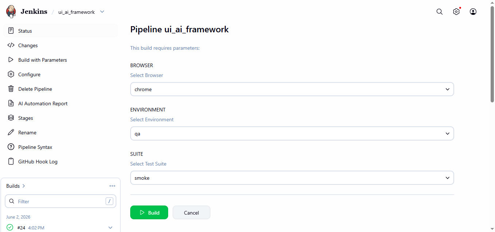
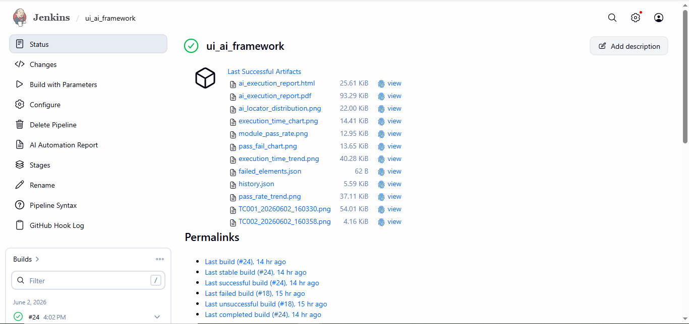

# 🚀 AI-Powered Test Automation Framework


An AI-powered self-healing test automation framework built using **Python, Playwright, Gemini AI, Jenkins, Docker, and Google Cloud Platform (GCP)**.

The framework combines traditional automation with Generative AI to dynamically generate test steps, identify UI elements, perform locator healing, and provide advanced execution analytics.

# 🎯 Project Highlights

✅ AI Locator Generation

✅ Self-Healing Automation

✅ Multi-Browser Execution

✅ Jenkins CI/CD Integration

✅ Dockerized Jenkins

✅ GCP Deployment

✅ HTML & PDF Reports

✅ Email Notifications

---

# 📌 Key Features

## 🤖 AI Capabilities

* AI Test Step Generation using Gemini AI
* AI Locator Generation
* Dynamic Locator Ranking
* Self-Healing Locators
* Locator Analytics Dashboard
* AI Usage Metrics

## 🧪 Automation Features

* Playwright-based UI Automation
* Page Object Model (POM)
* Multi-Browser Execution

  * Chrome
  * Firefox
* Multi-Environment Support

  * QA
  * UAT
  * PROD
* Smoke Suite Execution
* Regression Suite Execution
* Full Regression Execution

## 📊 Reporting

* HTML Report Generation
* PDF Report Generation
* Execution Analytics Dashboard
* Screenshot Capture
* Pass/Fail Metrics
* Module-wise Execution Summary

## ⚙️ CI/CD

* Jenkins Pipeline as Code
* GitHub Webhooks
* Automated Build Triggering
* Automated Artifact Publishing
* Email Notifications

## ☁️ Cloud & Infrastructure

* Google Cloud Platform (GCP)
* Dockerized Jenkins
* Secure Credential Management
* Environment-Based Configuration

---

# 🏗️ Architecture

```text
                    ┌─────────────────┐
                    │     GitHub      │
                    └────────┬────────┘
                             │
                             │ Push Code
                             ▼
                    ┌─────────────────┐
                    │ GitHub Webhook  │
                    └────────┬────────┘
                             │
                             ▼
                    ┌─────────────────┐
                    │     Jenkins     │
                    └────────┬────────┘
                             │
                             ▼
                    ┌─────────────────┐
                    │   JenkinsFile   │
                    └────────┬────────┘
                             │
             ┌───────────────┼───────────────┐
             │               │               │
             ▼               ▼               ▼

       Browser         Environment       Suite

       Chrome             QA            Smoke
       Firefox            UAT           Regression
       All                PROD          Full

                             │
                             ▼

                ┌──────────────────────┐
                │  Config Loader       │
                └──────────┬───────────┘
                           │
                           ▼

                ┌──────────────────────┐
                │ Playwright Framework │
                └──────────┬───────────┘
                           │
                           ▼

                ┌──────────────────────┐
                │      Gemini AI       │
                └──────────┬───────────┘
                           │
            ┌──────────────┼──────────────┐
            │              │              │
            ▼              ▼              ▼

     Test Step      Locator Generation   Healing
     Generation                         Engine

                           │
                           ▼

                ┌──────────────────────┐
                │ Test Execution Engine│
                └──────────┬───────────┘
                           │
                           ▼

                ┌──────────────────────┐
                │ Reporting Framework  │
                └──────────┬───────────┘
                           │
            ┌──────────────┼──────────────┐
            │              │              │
            ▼              ▼              ▼

      HTML Report     PDF Report     Screenshots

                           │
                           ▼

                ┌──────────────────────┐
                │ Email Notifications  │
                └──────────────────────┘
```

---

# 📂 Project Structure

```text
ui_ai_framework/

├── config/
│   ├── qa.json
│   ├── uat.json
│   └── prod.json
│
├── pages/
│   ├── login_page.py
│   └── employee_page.py
│
├── reports/
│   ├── ai_execution_report.html
│   ├── ai_execution_report.pdf
│   ├── screenshots/
│   └── analytics/
│
├── utils/
│   ├── ai_locator_engine.py
│   ├── browser.py
│   ├── config_loader.py
│   ├── report_manager.py
│   └── gemini_helper.py
│
├── test_scenarios.json
├── json_test_runner.py
├── run_tests.py
├── JenkinsFile
├── requirements.txt
└── README.md
```

---

# 🔄 Execution Flow

```text
                            User Trigger / GitHub Push
                                        │
                                        ▼
                            Jenkins Build Triggered
                                        │
                                        ▼
                            Load Environment Configuration
                                        │
                                        ▼
                            Generate Test Steps Using Gemini AI
                                        │
                                        ▼
                            Generate Dynamic Locators
                                        │
                                        ▼
                            Execute Playwright Tests
                                        │
                                        ▼
                            Perform Locator Healing (if required)
                                        │
                                        ▼
                            Capture Screenshots
                                        │
                                        ▼
                            Generate Reports
                                        │
                                        ▼
                            Publish Artifacts
                                        │
                                        ▼
                            Send Email Notification
```

---

# 📈 AI Analytics

Framework tracks:

* Total Locators Used
* Static Locators
* AI Generated Locators
* Healed Locators
* Healing Failures
* AI Success Rate

Example:

```text
AI Generated Locators : 14
Healed Locators       : 7
Healing Success Rate  : 100%
```

---

# 🌍 Environment Configuration

Supported Environments:

```text
QA
UAT
PROD
```

Example:

```json
{
    "environment": "QA",
    "base_url": "https://opensource-demo.orangehrmlive.com/",
    "username": "Admin",
    "password": "admin123"
}
```

---

# 🌐 Multi-Browser Support

Supported Browsers:

```text
Chrome
Firefox
All Browsers
```

Jenkins Parameters:

```text
BROWSER

chrome
firefox
all
```

---

# 🧪 Suite Execution

Supported Suites:

```text
Smoke
Regression
All
```

Jenkins Parameters:

```text
SUITE

smoke
regression
all
```

---

# ⚙️ Jenkins Pipeline Parameters

```text
BROWSER
---------
chrome
firefox
all

ENVIRONMENT
------------
qa
uat
prod

SUITE
------
smoke
regression
all
```

---

# 📧 Email Notifications

Automated email notifications are triggered after execution.

Included:

* Build Status
* Report Links
* Execution Summary
* Artifact Links

---

# 🔒 Security

Sensitive information is managed using Jenkins Credentials.

```text
GEMINI_API_KEY
QA_PASSWORD
UAT_PASSWORD
PROD_PASSWORD
```

No secrets are stored in source code.

---

# 🛠️ Installation

Clone Repository

```bash
git clone https://github.com/nageshgo/ui_ai_framework.git
```

Install Dependencies

```bash
pip install -r requirements.txt
```

Install Playwright

```bash
playwright install
```

Run Tests

```bash
python run_tests.py
```

---

# 💻 Technology Stack

* Python
* Playwright
* Gemini AI
* Jenkins
* GitHub
* Docker
* Google Cloud Platform (GCP)
* HTML Reporting
* PDF Reporting
* JSON Configuration
* Page Object Model (POM)

---

# 🚀 Future Enhancements

* Parallel Browser Execution
* AI Failure Analysis
* Slack / Teams Integration
* Advanced Trend Dashboard
* Self-Updating Locator Repository
* AI-Based Root Cause Analysis

---


# 📸 Screenshots
1. Jenkins parameters page screenshot
     
    

2. Jenkins pipeline screenshot

    

    

# 👨‍💻 Author

**Nagesh Gorre**

Automation Test Engineer | Python | Playwright | AI-Powered Automation | Selenium | 
| Jenkins | Appium | Pytest | Robot Framework | Java | API Automation | Requests Library | 
| RestAssured | Postman | GCP | AWS | BrowserStack | SauceLabs | 

GitHub:
https://github.com/nageshgo

Repository:
https://github.com/nageshgo/ui_ai_framework

